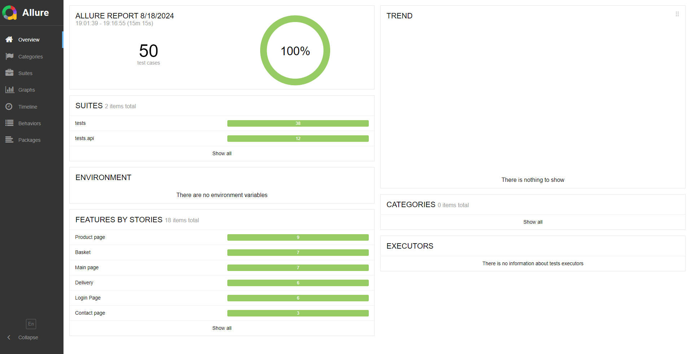

# Alza.sk Test Automation Project

This project is a test automation suite for the [alza.sk](https://www.alza.sk/) website, built using Python, Selenium, and pytest. The test results are generated using Allure. The project also includes Docker integration and API tests for [petstore.swagger.io](https://petstore.swagger.io/#/). The tests are structured using the Page Object Model (POM) design pattern.

```markdown
   
```

## Tested Pages

- Home Page
- Support Page
- Login Page
- Cart Page
- Delivery Page
- Product Page

## Features

- Automated tests for alza.sk
- Selenium WebDriver for browser automation
- Pytest for organizing and running tests
- Allure for generating comprehensive test reports
- Docker integration for simplified environment setup and test execution
- API tests for [petstore.swagger.io](https://petstore.swagger.io/#/)
- Support for both Chrome and Firefox browsers
- Implementation of Page Object Model (POM) for better code maintainability and reusability

## Installation

To get started with this project, clone the repository and install the required dependencies:

```bash
git clone https://github.com/ArretWins/Alza_diplom.git
cd Alza_diplom
pip install -r requirements.txt
```

## Running Tests
```bash
# Run tests with pytest
pytest

# Run all tests with make and allure
make test-all
```

## Docker Integration
```bash
docker build -t alza .

docker run --rm alza make test-api
```
